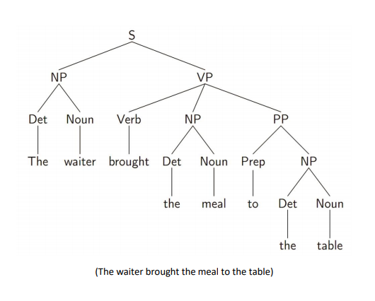
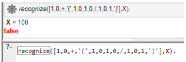
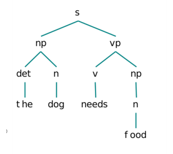
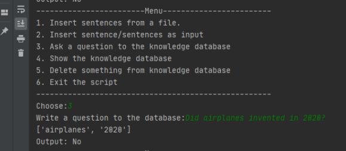
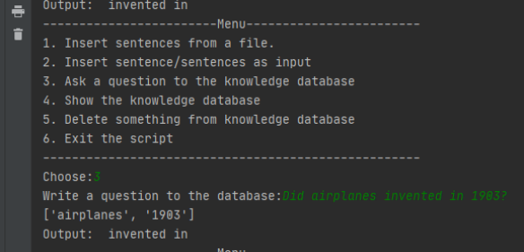

thema2.pl - (a) With which grammar in DCG formats technologies require the development of: [the,
waiter, brought, the, meal, at, the table], with the shaped figure?
(b) With what grammar in DCG forms do we produce in functor form the
supplement tree to identify intent:

thema3.pl - Develop a program that recognizes and calculates numeric expressions of binary numbers using prolog.

thema4.py - Lexical Analyzer Development in another Programming language.

thema5.py - Development of a Syntactic Analyzer in another Programming language.

thema7.py -  Development of a knowledge base - knowledge graph that the user can give a question and get an answear.

